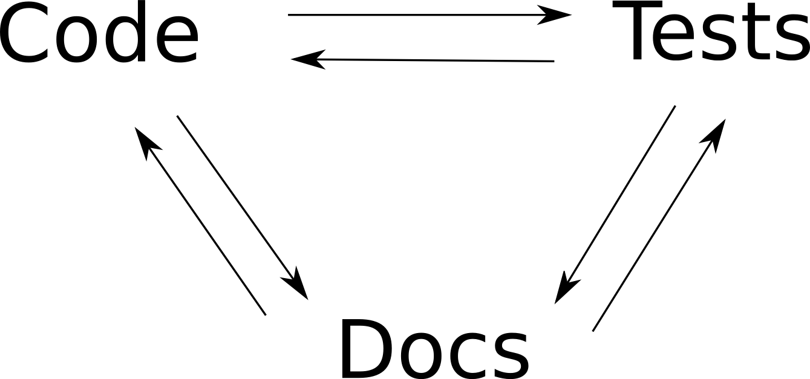

# Closing the Documentation Loop

## Hi, Everyone!

- [twitter](http://twitter.com/ananelson) & [github](http://github.com/ananelson) @ananelson
- Author of 
- Consultant with 

## Slides
TODO link to slides

# Documentation

# The Broccoli of Programming

# Let's Blame Developers!

## Reasons Developers Shouldn't Write Docs
- They're expected to do it "for free".
- Documentation isn't really valued.
- Writing documentation is futile.
- The tools are terrible (e.g. wikis).
- It's not part of the development process.

## Let's turn these around!
- Give developers time to write docs.
- Value documentation as if it were the product (it is).
- Keep documentation up to date.
- Use awesome developer-friendly tools.
- *Make documentation part of the development process.*

## Waterfall
1) Documentation
2) Code
3) Testing

## Agile
1) Tests & Code
1.1) Tests & Code
1.1.1) Tests & Code
1.1.1.1) Tests & Code
2) Documentation?

## Synchronized
1) Code & Docs & Tests
1.1) Tests & Code & Docs
1.1.1) Docs & Tests & Code
1.1.1.1) Code & Docs & Tests

# More Opportunities for Feedback

# More Complexity?

# Automation

# What does this look like?

## Kinds of Documentation
- Implementation Documentation
- Developer Guides, Tutorials
- User Guides, Tutorials
- API Documentation

## How I Am Writing Dexy's Docs
- (Mindless) Implementation Docs
- Developer Docs
- User Docs
- Command Line Help

## Mindless Implementation Docs
- Start somewhere with some method.
- Refactor until it's small enough to discuss.
- Repeat with the first method it calls.
- (You end up with all methods in a module/class in call order.)
- Makes you reorganize & clean up code.

## Before
<pre>
{{ d['dev-before.py|pyg'] }}
</pre>

## After

{{ highlight(d['dev-after.py|pydoc'][section + ":source"], 'python') }}

{{ pydoc('Website.apply_and_render_template') }}

## Lessons
- Mindless tasks help you get un-stuck.
- Viewing code in a different context makes you see it differently.
- Viewing code on "paper" changes the aesthetic and expectations.
- Broken Window Theory: If code is nice everywhere, you'll want to keep it that way.

# User Docs

# Your Users Can't Skip Steps

# So Neither Can You

## User Docs
- Start describing how people should use dexy.
- Do this, then this, then- oh. Um, sorry.
- When something is too hard, simplify it (right now)
- When users need to get information, implement command line help (right now).
- When a feature is obviously missing, open & embed a ticket.
- When I make a claim, prove it (embed the test).
- If it will take too long to prove it, open & embed a ticket.

## Embedding Tickets
- Tickets doing double duty:
    - Communicating with readers.
    - Serving as reminder of work.

## Command Line Help
- Natural for a command line tool.
- More personalized than static API docs.
- Output can be incorporated into other docs.

## Dexy User Guide

<http://dexy.github.io/dexy-user-guide/#_workspaces>

## Summary
- Developing docs, code and tests together = 3x the learning.
- Use automation to reduce complexity.

## Pretty By Default
- Check out http://asciidoctor.org
- It's a markup language.
- It looks pretty.
- Good for single-page HTML and PDF.
- You can switch later

## Thanks!

- [twitter](http://twitter.com/ananelson) & [github](http://github.com/ananelson) @ananelson
- http://dexy.it

